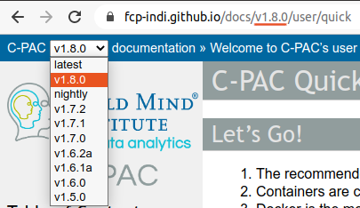

<!-- TOC -->

- [Branches](#branches)
    - [Versions](#versions)
        - [`nightly`](#nightly)
        - [C-PAC release tags](#c-pac-release-tags)
- [Guidelines](#guidelines)
    - [Building](#building)
        - [Let CircleCI build your drafts / works-in-progress](#let-circleci-build-your-drafts--works-in-progress)
        - [Build locally](#build-locally)
- [Flowcharts](#flowcharts)
- [References and citations](#references-and-citations)
- [Environment notes](#environment-notes)

<!-- /TOC -->

## Branches

Please, always base changes on the `source` branch. `master` branch will be overwritten by the CI deployment.

### Versions

#### `nightly`

Pushes to `source` will rebuild docs at https://fcp-indi.github.io/docs/nightly

#### C-PAC release tags
Tags in the format `v.*-source` will build docs for the given version.

If a matching version tag doesn't exist in https://github.com/FCP-INDI/C-PAC/tags, the build should fail.

Steps to build a release:
1. Checkout a commit from the `source` from a time appropriate for documentation for the branch being built/rebuilt.
2. If you need to make changes, create a branch (`git switch -c` or `git checkout -b`).
3. Make any changes you need for the specific version.
4. Tag the commit that's ready to build (`git tag v`version`-source`)
5. (Force) push to the remote tag (`git push origin v`version`-source`).
6. CircleCI should deploy the versioned documentation. If the version tag is the newest, it should also overwrite `latest` with these documents. 

## Guidelines

- Only write a document once, and liberally use the [reStructured Text `.. include::` directive](https://docutils.sourceforge.io/docs/ref/rst/directives.html#include) to include that document where appropriate.
- Use absolute paths for `.. include::`s. That way the path will resolve correctly regardless of differences in nesting levels.
- Include any source documents that you want built in at least one [`toctree`](https://www.sphinx-doc.org/en/1.8/usage/restructuredtext/directives.html#directive-toctree). Use the `:hidden:` option if you don't want it linked in an actual table of contents in the document with the `toctree`.
- Use consistent section title indicators throughout a sourcetree. [fcp-indi.github.com/docs/user](https://fcp-indi.github.com/docs/user) currently has the following hierarchy (top to bottom):
  ```
  =
  ^
  -
  *
  #
  `
  '
  "
  ```

### Building

#### Let CircleCI build your drafts / works-in-progress
* Build environment will match actual docs build environment
* CircleCI takes ~2 minutes to build
1. Fork https://github.com/FCP-INDI/fcp-indi.github.com
1. In your fork's settings, set the GitHub Pages `source` to `master` branch
    
1. Add your project on CircleCI
1. Merge your draft / work-in-progress into your fork's `source` branch. Make sure you push to your fork and not the main repository's `source` branch.
1. Your fork will publish at `https://[your_GitHub_username].github.io/fcp-indi.github.com/`.

#### Build locally
This documentation aspires to rely on a [single source of truth](https://en.wikipedia.org/wiki/Single_source_of_truth) where possible.  To this end, building this documentation requires an installation of the version of [C-PAC](https://github.com/FCP-INDI/C-PAC) that is being documented.

Steps to build this documentation locally:
1. Clone this repository.
1. _(optional)_ <details><summary>Locally replicate the step "👊 Running cpac commands" from [.circleci/config](./.circleci/config) to generate [cpac](https://pypi.org/project/cpac/) usage strings.</summary>
    Either perform this "👊 Running cpac commands" step in a separate Python environment or uninstall cpac after generating the usage string(s).
    1. _(optional)_ Create an environment for cpac and activate this environment.
    1. `pip install cpac`
    1. If you don't have a local container for the version of C-PAC you're documenting, `cpac pull` to download the latest or `cpac pull --tag $TAG` to pull a specific version.
    1. Generate ReStructuredText documents with cpac usage strings:
       ```BASH
        mkdir -p docs/_sources/user/cpac
        printf ".. code-block:: console\n\n   $ cpac --help\n\n" > docs/_sources/user/cpac/help.rst
        cpac --help | sed -e "s/.*/   &/" >> docs/_sources/user/cpac/help.rst
        mkdir -p docs/_sources/user/run
        printf "Usage: cpac run\n\`\`\`\`\`\`\`\`\`\`\`\`\`\`\`\n.. code-block:: console\n\n   $ cpac run --help\n\n" > docs/_sources/user/run/help.rst
        cpac run --help | sed -e "s/.*/   &/" >> docs/_sources/user/run/help.rst
        mkdir -p docs/_sources/user/utils
        printf "Usage: cpac utils\n\`\`\`\`\`\`\`\`\`\`\`\`\`\`\`\`\`\n.. code-block:: console\n\n   $ cpac utils --help\n\n" > docs/_sources/user/utils/help.rst
        cpac utils --help | sed -e "s/.*/   &/" >> docs/_sources/user/utils/help.rst
        ```
    1. `deactivate` your cpac environment if you used a separate environment or `pip uninstall cpac`.
    </details>
1. Locally install [C-PAC](https://github.com/FCP-INDI/C-PAC) from source.
1. Run `./bin/build $VERSION` where `$VERSION` is the version to build (`nightly`, `latest`, or [<span title='Semantic Versioning'>semver</span>](https://semver.org/) for production, but this string can be anything you want locally). 

## Flowcharts

- SVGs exported from Lucidchart have scaling coded in in `width` and `height` XML attributes. Add the XML attributes `preserveAspectRatio="xMinYMin meet"` and `viewBox` to the SVG element in the actual SVG files:

```xml
<svg preserveAspectRatio="xMinYMin meet" viewBox="0 0 {width} {height}"></svg>
```

where `{width}` and `{height}` are the values already present in the existing `width` and `height` XML attributes.
- Load SVGs in HTML `object` elements with the `raw:: html` directive to preserve hyperlinks and scaling:

```rst
.. raw:: html

    <object data="../_static/path/to/chart.svg" type="image/svg+xml"></object>
```

## References and citations

[sphinxcontrib-bibtex](https://sphinxcontrib-bibtex.readthedocs.io/) is installed and configured. This extension creates links between the citations and the reference in the reference list and formats citations in referenced BibTeX files using built-in or [custom styles](https://github.com/FCP-INDI/fcp-indi.github.com/blob/source/docs/_sources/references/style.py). To use this Sphinx extension, 

1. Include your citations in a BibTeX file (see the `*.bib` files in [docs/_sources/references](https://github.com/FCP-INDI/fcp-indi.github.com/blob/source/docs/_sources/references) for examples).
2. Using the key (the text between the opening `{` and the first `,` in a BibTeX entry) use the ReStructuredText syntax `` :cite:`key` `` to cite your reference in a ReStructuredText file.
3. Include a `.. bibliography::` directive somewhere on any page that you want to use this extension to format references and create two-way links between the references and citations. Specify the (one) BibTeX file for this reference list any formatting for the reference list in this directive. Both `:cite:` and `.. bibliography::` need to be rendered on the same page for the links to generate.
4. If you will (or might) use more than one `.. bibliography::` directive on a single rendered page (including `.. include::` directives), choose a prefix for the keys and include that prefix in both the `:cite:` role (like `` :cite:`prefix-key` ``) and the bibliography directive (like `:keyprefix: prefix-`).
5. If you want to include a header over a reference list, use the `.. rubric::` directive above its `.. bibliography` directive.
6. If the entry type (e.g., `book`, `article`, `misc`) of any of the entries in your BibTeX file(s) is not included in [docs/_sources/references/style.py](https://github.com/FCP-INDI/fcp-indi.github.com/blob/source/docs/_sources/references/style.py), add a `get_{entry_type}_template` [Pybtex](https://pybtex.org) method to `CPAC_DocsStyle`.

For example, if you have a BibTeX file called `cpac_citation.bib` that contains

```BibTeX
@ARTICLE{cpac2013,
    AUTHOR={Craddock, Cameron  and  Sikka, Sharad  and  Cheung, Brian  and  Khanuja, Ranjeet  and  Ghosh, Satrajit S
        and Yan, Chaogan  and  Li, Qingyang  and  Lurie, Daniel  and  Vogelstein, Joshua  and  Burns, Randal  and
        Colcombe, Stanley  and  Mennes, Maarten  and  Kelly, Clare  and  Di Martino, Adriana  and  Castellanos,
        Francisco Xavier  and  Milham, Michael},
    TITLE={Towards Automated Analysis of Connectomes: The {Configurable Pipeline for the Analysis of Connectomes (C-PAC)}},
    JOURNAL={Frontiers in Neuroinformatics},
    YEAR={2013},
    NUMBER={42},
    URL={http://www.frontiersin.org/neuroinformatics/10.3389/conf.fninf.2013.09.00042/full},
    DOI={10.3389/conf.fninf.2013.09.00042},
    ISSN={1662-5196}
}
```

If you include

```rst
To cite C-PAC, use :cite:`cite-cpac2013`.

.. rubric Cite C-PAC

.. bibliography:: cpac_citation.bib
   :style: cpac_docs_style
   :cited:
   :keyprefix: cite-
```

The rendered file should look something like

> To cite C-PAC, use <a name="backref1" href="#ref1">[1]</a>.
> 
> __Cite C-PAC__
> 
> <a name="ref1" href="#backref1">[1]</a> Craddock, C., Sikka, S., Cheung, B., Khanuja, R., Ghosh, S. S., Yan, C., Li, Q., Lurie, D., Vogelstein, J., Burns, R., Colcombe, S., Mennes, M., Kelly, C., Di Martino, A., Castellanos, F. X., and Milham, M. 2013. [Towards automated analysis of connectomes: the Configurable Pipeline for the Analysis of Connectomes (C-PAC).](http://www.frontiersin.org/neuroinformatics/10.3389/conf.fninf.2013.09.00042/full) *Frontiers in neuroinformatics* 42. doi:[10.3389/conf.fninf.2013.09.00042](https://dx.doi.org/10.3389/conf.fninf.2013.09.00042)

## Environment notes
* Because [C-PAC](https://github.com/FCP-INDI/C-PAC.git) and [cpac](https://github.com/FCP-INDI/cpac.git) have conflicting commandline commands, we first run any `cpac` commands in a virtual environment and spoof the `command-output` directive with `code-block` like 
   ```RST
   .. code-block:: console

       cpac run --help
       
   .. program-output:: cpac_py run --help
      :shell:
      :ellipsis: 0,9
   ```
* :heavy_plus_sign: Check [`.circleci/config.yml`](https://github.com/FCP-INDI/fcp-indi.github.com/blob/source/.circleci/config.yml) of the branch you're working from for build dependencies.
* :octocat: Set an environment variable `GITHUBTOKEN` to a [personal access token](https://help.github.com/en/github/authenticating-to-github/creating-a-personal-access-token-for-the-command-line) to increase [your API rate limit](https://developer.github.com/v3/#rate-limiting) from 60 to 5000 requests per hour (for getting [release notes from GitHub](https://github.com/FCP-INDI/C-PAC/releases)).
